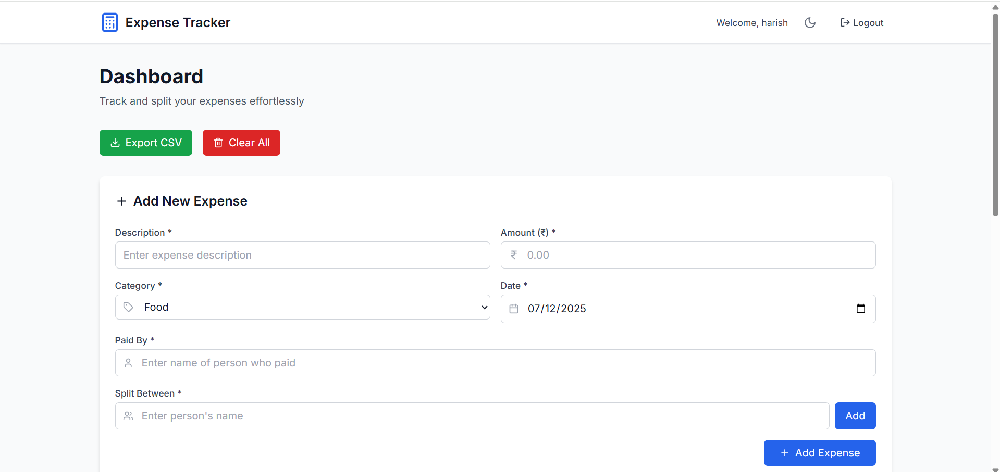
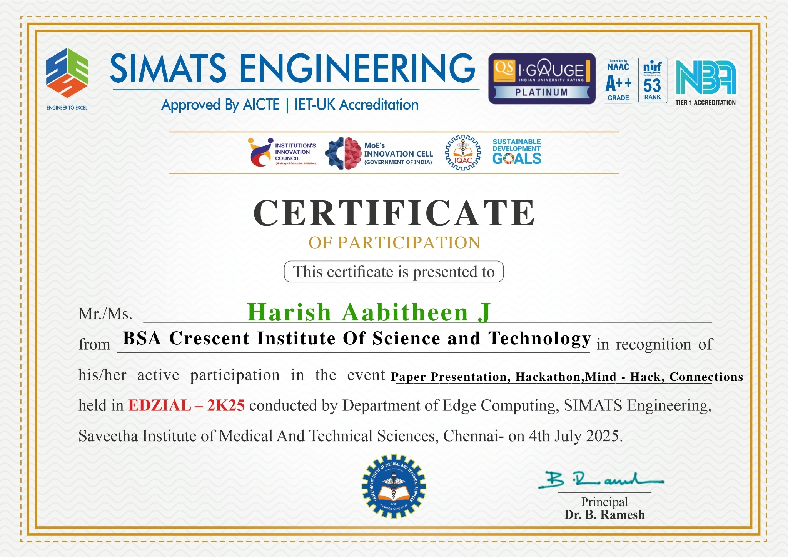

# 💸 Expense Tracker & Splitter (Hackathon Project)



A modern and responsive web app to **track expenses** and **split bills** among multiple users — built with **React + TypeScript + Vite** during the **EDZIAL – 2K25 Hackathon** at **SIMATS Engineering College**.

This project aims to simplify financial tracking for individuals and groups (like roommates, friends, or travel buddies) by offering a clean UI and precise calculations of personal and shared spending.

---

## 🚀 Live Demo

> [🔗 https://curious-fudge-e51d78.netlify.app/]

---

## 🧠 Core Features

- 🔐 Add user authentication (Login/Signup)
- 📤 Export expense reports (CSV/PDF)
- ✅ Add personal/group expenses with categories and notes
- 🧮 Automatically split expenses among users
- 📊 View detailed analytics (totals, who owes whom, etc.)
- 🧾 Track history of expenses in real-time
- 📱 Fully responsive design (mobile-first)

---

## 🛠️ Tech Stack

| Layer      | Tools & Libraries                              |
|------------|------------------------------------------------|
| **Frontend** | React, TypeScript, Vite                      |
| **Styling**  | CSS Modules / Tailwind CSS (based on your choice) |
| **State Management** | React Hooks, useState / useContext        |
| **Icons/UI** | React Icons / Custom components              |
| **Build Tool** | Vite                                       |

---

## 📦 Getting Started

### Prerequisites

- Node.js (v16+)
- npm / yarn

### Installation

```bash
# 1. Clone the repository
git clone https://github.com/your-username/expense-tracker-splitter.git
cd expense-tracker-splitter

# 2. Install dependencies
npm install
# or
yarn install

# 3. Start the development server
npm run dev
# or
yarn dev
```

Open your browser at `http://localhost:5173`

---

## 🎯 Future Roadmap

- 💬 WhatsApp or email notifications
- 📅 Recurring bill reminders

---

## 🏁 Hackathon Info

🧠 Participated in: **EDZIAL – 2K25**  
🏫 Organized by: **SIMATS Engineering College (Department of Edge Computing)**  
📍 Location: Chennai  
📆 Date: 4th July 2025

  

---

## 🙋‍♂️ Author

**Harish Aabitheen J**  
🎓 BSA Crescent Institute of Science and Technology  
🔗 [LinkedIn](https://www.linkedin.com/in/harishaabi)  
🔗 [GitHub](https://github.com/Aabi7904)

---

## 📜 License

This project is licensed under the MIT License – feel free to use and modify!

---

## ⭐️ Give it a Star!

If you found this project helpful, please consider giving it a ⭐️ on [GitHub](https://github.com/Aabi7904/Expense-Tracker-Splitter)!
